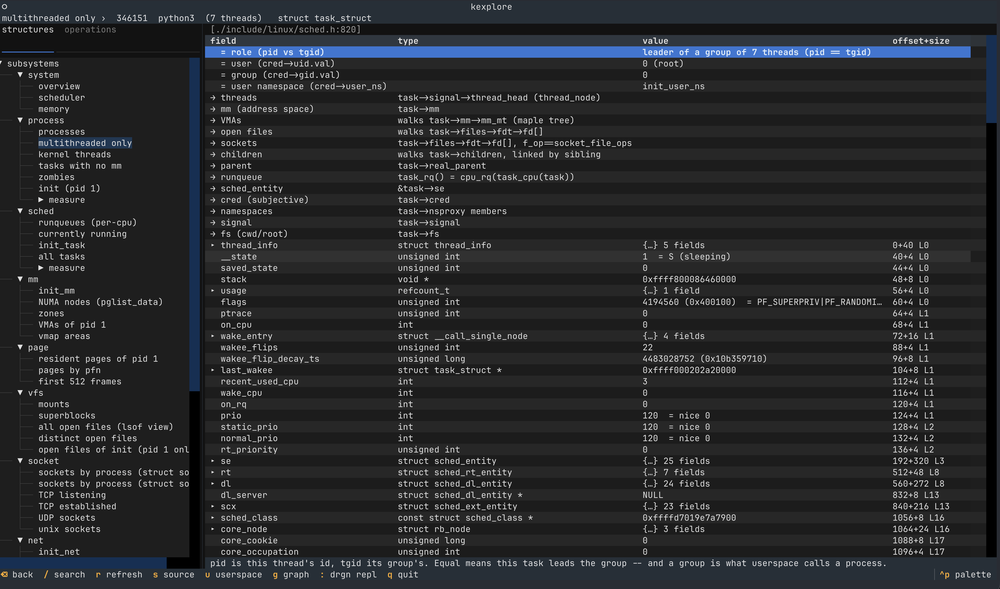
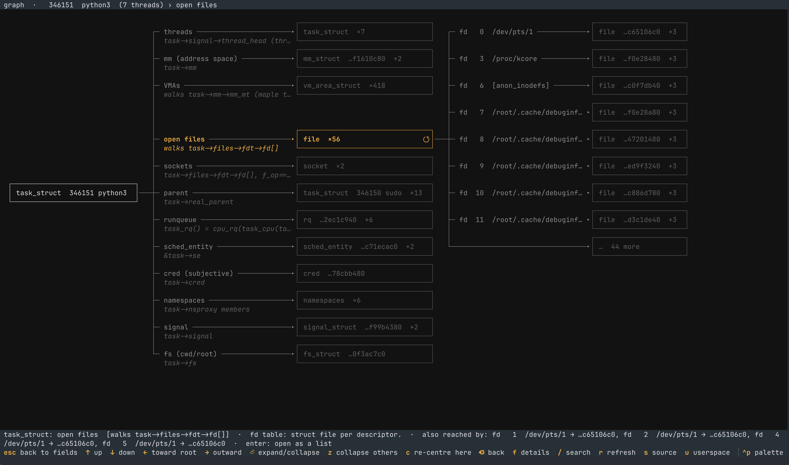

# kexplore

A terminal explorer for a live Linux kernel, built on
[drgn](https://drgn.readthedocs.io/).

Explore a live kernel as a map of connected objects. Start from a subsystem or
an object such as a task, then follow its fields and curated relationships to
its threads, address space, VMAs, open files, sockets, and more. Operations use
the same objects to walk through paths such as a page fault, linking each step
to the functions and structures it uses.

## See it in use

| Browse the live kernel | Follow an object's relationships |
| --- | --- |
| <a href="docs/images/structure-browser.png"></a> | <a href="docs/images/task-graph.png"></a> |

Click an image to open it at full size.

```
process › 611 auditd › threads › 612 gmain › mm (address space) › VMAs
```

## Setup

```sh
./setup.sh          # create and provision the lima VM (default name: kernel-lab)
./run.sh            # start the explorer
./run.sh --check    # resolve every entry against this kernel, no UI
```

`run.sh` executes inside the VM as root, because reading `/proc/kcore` requires
it. The repo is mounted from the host at the same path, so there is nothing to
sync.

## Views

Tabs in the sidebar. Each is a different way into the same kernel.

- **structures**: the subsystem tree. Open a struct, follow its fields.
  Curated links (`→`) add edges that are not fields, such as a task's threads,
  and each one shows where it comes from (`task->signal->thread_head`).
  Field documentation is the kernel's own comments for this exact build.
- **operations**: what the kernel does, using live data. Some are ordered
  steps (task wakeup, page fault), each naming a function resolved to
  `file:line` and opening the structures it touches. Others are analyses of a
  single moment: which task EEVDF would pick and why, what a thread shares with
  its parent that a fork copies, how many pages a child still shares.

Subsystems also have a **measure** group: run a tracer for a couple of seconds
and show the result. Nothing runs in the background.

## Keys

| key | action |
|---|---|
| `enter` | follow the row under the cursor |
| `backspace` | back |
| `s` | show the kernel source for this struct field or function |
| `g` | open the dependency graph, or return to the one you left |
| `/` | filter rows |
| `r` | re-read from live memory |
| `:` | drgn REPL with `prog` and the current object bound to `obj` |
| `q` | quit |

Boxes are structs. The line between two boxes is the traversal that reaches the
second. It carries the edge's name, and beneath it the operation itself:
`task->mm`, `walks task->files->fdt->fd[]`, `task_rq() = cpu_rq(task_cpu(task))`.

Only the centre box starts expanded. A collapsed box shows how many edges it
holds, `mm_struct  …c94da580  +2`. A collection shows its size, `file  ×156`.

| key | action |
|---|---|
| `→` | expand this box, or move to its first child |
| `←` | collapse this box, or move to its parent |
| `↑` `↓` | move to the box above or below |
| `enter` | expand or collapse, without moving |
| `z` | collapse every branch except this one |
| `c` | re-centre the graph on this box |
| `backspace` | undo the last re-centre |
| `f` | open this box in the table: its fields, or its rows if a collection |
| `escape` | close the graph |

`:` matters: the UI is for finding things, the REPL for interrogating them.

## Working offline

The kernel's DWARF is a few hundred megabytes fetched from Fedora's debuginfod
server. libdebuginfod writes it to a temporary name and only renames it into the
cache when the transfer *completes* (there is no resume), so quitting the
explorer mid-fetch throws the whole download away and the next run starts over.

Fetch it once in a single uninterrupted transfer, and later runs read it from
the cache:

```sh
./run.sh --prefetch          # downloads to completion, with progress
./run.sh --offline           # cache only; never touches the network
```

The cache is keyed by the kernel's build-id, so an upgraded kernel means a new
download of the same size; the superseded copy stays on disk. Retention is a
year without a read, not indefinite.

`--offline` (or `KEXPLORE_OFFLINE=1`) points debuginfod at a closed port. That
is not the same as unsetting `DEBUGINFOD_URLS`, which makes the client return
`ENOSYS` without ever consulting the cache; with a dead URL the cache is still
searched first and only genuine misses fail: instantly, instead of stalling on
a roaming connection.

`--prefetch` also deletes abandoned partial downloads, which cost the size of a
vmlinux each. libdebuginfod separately prunes any cached file it has not read
for a week and re-probes a cache miss after ten minutes. Both are too short to
hold a deliberately prefetched vmlinux, so startup raises the retention limit to
a year and the re-probe interval to a day.

## Docs

[docs/how-it-works.md](docs/how-it-works.md) covers drgn, debuginfod, pahole,
addr2line and bpftrace, and what each is responsible for.

[docs/ideas.md](docs/ideas.md) collects what is not built yet: the three kinds
of view the current one cannot express, and the subsystems nothing in the
catalog reaches.

## Layout

```
core/       mechanism, and no Linux knowledge: rows, types, layout, source,
            probes. core/graph.py never reads memory, so the drawing can be
            tested anywhere.
catalog/    what exists in Linux: entry points per subsystem, the curated
            links between structures, what raw field values mean.
operations/ views that are computed rather than browsed: step sequences,
            analyses, controlled experiments.
view/       catalog items turned into tables of rows. Imports no UI toolkit.
tui/        Textual: when to build a frame, which one is on screen, what the
            keys do to it.
```

## Tests

```sh
./run.sh --test              # everything, inside the VM
python3 tests/run_all.py     # on the host: the tests that need no kernel
```

Most tests attach to the live kernel, so they need the VM and root; `run_all.py`
says which it skipped and why. `tests/helpers/` holds programs that *make
something happen* so a measurement has something to see; they are not tests and
are not run.

`test_crawl.py` is the important one: it visits everything reachable in two hops
from every entry and reports what raises. Every bug that reached a user was a
type violating an assumption held elsewhere, and targeted tests only visit types
someone already thought about.
